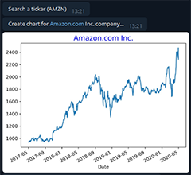

	

  

<h2 align="center">Investbot allows you to do the following:</h2>

<ul>
    <li>
    Getting share price chart for the last 3 years (available from version 2)
    </li> 
    

	
    
 
    <li>
    Getting information about net income for the quarter (available from version 2)
    </li> 
    

	
    
 
    <li>
    Get information about multiplier values for the entered Ticker (available from version 1)
    </li> 
    

	
    

</ul>

<h2 align="center">In developing used:</h2>

* [Python](https://www.python.org/downloads/) A simple and powerful programming language ♥.
* [pyTelegramBotAPI](https://github.com/eternnoir/pyTelegramBotAPI) A simple, but extensible Python implementation for the Telegram Bot API.
* [beautifulsoup4](https://pypi.org/project/beautifulsoup4/) Beautiful Soup is a library that makes it easy to scrape information from web pages.
* [Requests](https://pypi.org/project/requests/) Requests is an elegant and simple HTTP library for Python, built with ♥.
* [Matplotlib](https://pypi.org/project/matplotlib/) Matplotlib is a comprehensive library for creating static, animated, and interactive visualizations in Python.

<h4>Contacts:</h4>

[Linkedin](https://www.linkedin.com/in/kazzila) 
[Telegram](https://t.me/kazzila) 
[VK](https://vk.com/kazzila) 

[Investbot](http://t.me/Rationalinvest_bot)
